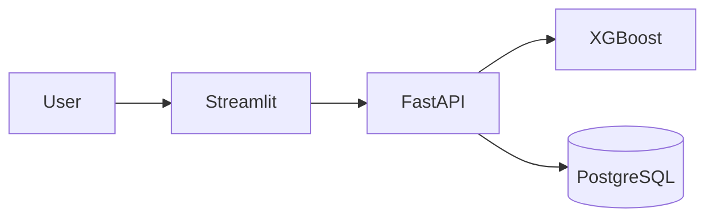

# 🚦 STATS19 Road Casualty Severity Prediction

End-to-end machine learning application for predicting whether a road casualty is likely to be **Severe** or **Non-severe** using 2023 Great Britain STATS19 road safety data.

The project combines an XGBoost classification pipeline with a production-style architecture using **FastAPI, PostgreSQL, Streamlit, Docker Compose, automated testing, and GitHub Actions CI**.

---

## 📊 Model Performance

| Metric | Score |
|---|---:|
| Macro F1 | **0.619** |
| Severe Recall | **0.649** |
| Severe Precision | **0.361** |
| ROC-AUC | **0.739** |
| Average Precision | **0.430** |

The final model is a **cost-sensitive XGBoost classifier** designed to improve detection of the minority Severe class.

---

## 🏗️ Architecture



### Application Flow

- **Streamlit** — frontend for single and batch prediction
- **FastAPI** — prediction API and request validation
- **XGBoost** — trained classification pipeline
- **PostgreSQL** — prediction logs, batch tracking, and model versioning
- **Docker Compose** — runs the complete application stack

---

## ⚙️ Features

- Single-record prediction through `POST /predict`
- Batch inference through `POST /predict/batch`
- Vectorised batch scoring
- Prediction logging in PostgreSQL
- Batch traceability using `batch_id`
- Model version tracking
- SHAP feature-importance analysis
- Oversampling sensitivity analysis
- Automated API tests with Pytest
- GitHub Actions continuous integration
- Dockerised Streamlit, FastAPI, and PostgreSQL services

---

## 🚀 Running the Application

### 1. Create the environment file

Create a `.env` file using `.env.example` as a template.

### 2. Start the full application

```bash
docker compose up -d --build
```

### 3. Open the application

**Streamlit frontend**

```text
http://localhost:8501
```

**FastAPI documentation**

```text
http://localhost:8000/docs
```

---

## 🧪 Running the Tests

Run:

```bash
python -m pytest -v
```

Current automated test suite:

```text
4 passed
```

The tests cover:

- API health check
- Verified single prediction
- Batch prediction
- Empty batch rejection

---

## 📁 Repository Structure

```text
├── app/              # FastAPI backend
├── frontend/         # Streamlit frontend
├── model/            # Trained model and metadata
├── data/             # Demo input data
├── outputs/          # SHAP and evaluation outputs
├── sql/              # PostgreSQL schema and queries
├── tests/            # Automated API tests
├── scripts/          # Utility and validation scripts
├── .github/          # GitHub Actions workflow
├── Dockerfile
├── compose.yaml
├── pytest.ini
└── requirements.txt
```

---

## 🛠️ Tech Stack

**Machine Learning:** Python, Pandas, NumPy, Scikit-learn, XGBoost, SHAP

**Backend:** FastAPI, Pydantic, Uvicorn

**Database:** PostgreSQL, Psycopg

**Frontend:** Streamlit

**Engineering:** Docker, Docker Compose, Pytest, GitHub Actions, Git

---

## ⚠️ Limitations

- Trained on 2023 STATS19 data only
- Severe casualties remain a minority class
- Severe-class precision is relatively low
- Input data must follow the same preprocessing schema used during training
- Predicted probabilities should not be interpreted as perfectly calibrated real-world risk estimates
- This is a portfolio and academic demonstration only and is not intended for operational road-safety decision-making

---

## 👩‍💻 Author

**Umrah**  
MSc Data Science  
